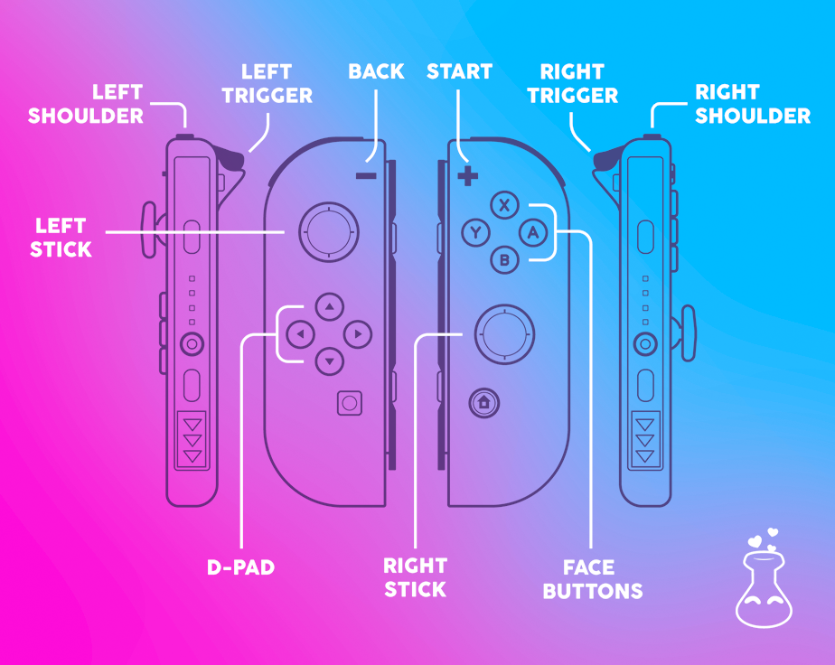

!> LÖVE Potion is a work in progress, so things may be missing. Please open an issue on the [GitHub Repository](https://github.com/TurtleP/LovePotion) if there's a feature you'd like to request.

## Drawing

The `love.draw` callback has a `screen` parameter. This does not affect the Nintendo Switch version.
For example, if you wish to draw to only _one_ screen. You would simply check against the `screen` value that was passed in:

```lua
function love.draw(screen)
    if screen ~= "bottom" then
        -- render top screen
    end
end
```

The following screen values are what get passed per console:

- Nintendo 3DS: `left` , `right` , and `bottom` .
- Nintendo Switch: `default`
- Nintendo Wii U: `tv` and `gamepad`

Additionally, textures (such as png or jpg files) must be converted to the their proper formats on Nintendo 3DS before they can be used.

## Stereoscopic 3D Depth

!> Stereoscopic depth is only for Nintendo 3DS. This is function will always return zero on Nintendo 2DS family systems. If you wish to test 3D depth, consider finding someone who has a 3DS system to help out.

The Nintendo 3DS has stereoscopic 3D--it allows for the use of 3D effects on its top screen without 3D glasses. To control this, use `love.graphics.getDepth()`. This will return the 3D slider's current value, which is in the range of zero to one. One way for this to work is through this example:

```lua
local str, font = "Hello World", nil
local textDepth = 6
function love.load()
    font = love.graphics.getFont()
end

function love.draw(screen)
    if screen == "bottom" then
        return
    end

    local sysDepth = -love.graphics.getDepth()

    if screen == "right" then
        sysDepth = -sysDepth
    end

    local left = math.floor(0.5 * (400 - font:getWidth(str)))
    love.graphics.print("Hello World", left - sysDepth * textDepth, 120)
end
```

We define where the main `x` coordinate should be defined as `left` . This specifically is the anchor point to draw at. In this case, it's going to be in the center of the screen. This value is then subtracted by what the depth value currently is on the system and multiplied by a constant `z` value.

## System Font Loading

One can load a system font using the follwing names in place of the path parameter for `love.graphics.newFont`:

### Nintendo 3DS & Wii U

| Name      | Notes                               |
| --------- | ----------------------------------- |
| standard  | JPN, USA, EUR, and AUS regions font |
| chinese   | Chinese font                        |
| korean    | Korean font                         |
| taiwanese | Taiwanese font                      |

### Nintendo Switch

| Name                        | Notes                               |
| --------------------------- | ----------------------------------- |
| standard                    | JPN, USA, EUR, and AUS regions font |
| chinese simplified          | Simplified Chinese font             |
| chinese traditional         | Traditional Chinese font            |
| extended chinese simplified | Extended Simplified Chinese font    |
| korean                      | Korean font                         |
| nintendo extended           | Nintendo Extended Symbols font      |

It is important to note that for custom fonts you must convert your TrueType or OpenType font to bcnft on Nintendo 3DS. This can be done when bundling your game via [the bundler website](/packaging.md)

The Standard font on Nintendo 3DS holds the glyph data for various symbols, like the Play Coin icon. However, these glyphs are stored in the Nintendo Extended Symbols font on Nintendo Switch. Here is a basic example:

```lua
local utf8 = require("utf8")

-- get the encoded utf8 of the Play Coin icon
local glyph = utf8.char("0xE075")

function love.load()
    -- if we're on Switch, set extended as our current font
    if love._console == "Switch" then
        love.graphics.setNewFont("nintendo extended", 14)
    end
end

function love.draw(screen)
    -- this will only render on the top
    -- screen for 3DS and will render on Switch regardless
    if (screen and screen ~= "top") then
        return
    end

    love.graphics.print(glyph)
end
```

## ImageData on 3DS

?> If you're not familiar with ImageData, please [view the LÖVE Wiki](https://love2d.org/wiki/ImageData)

The main difference between LÖVE and LÖVE Potion when it comes to ImageData is the `rawdata` parameter for the constructor. When it is supplied, the data must be tiled (e.g. with data from a \*.t3x texture). This will throw an error otherwise.

## Extended System Functions

Since the Nintendo 3DS and Nintendo Switch are a bit different than your traditional LOVE environment, the following `system` module functions were added:

- `love.system.getNetworkInfo()`
  - Returns whether or not the system has an internet connection
- `love.system.getFriendInfo()`
  - Returns the name of the user running LÖVE Potion (or your game) and friend code (if applicable)
- `love.system.getPreferredLocales()` (LÖVE 12)
  - Returns the current System Language as a string

These are especially useful for either UI, netplay, or even multi-language support!

## Console-Only Constants

Both the 3DS and Switch versions of LÖVE Potion have the following constants:

- `love._console`⁵
  - Returns the name of the console, "3DS", "Switch", or "Wii U"
- `love._potion_version`
  - Returns the version of LÖVE Potion
- `love._os`
  - Returns the Operating System of the console, "Horizon" or "Cafe"

## Software Keyboard

Calling `love.keyboard.setTextInput` brings up the System Software Keyboard applet. Pass a table to configure it:

| Config     | Notes                                   |
| ---------- | --------------------------------------- |
| type       | basic, numpad, and standard<sup>1</sup> |
| isPassword | makes the text hidden after entry       |
| hint       | Text to prompt for on the input         |

<sup>1</sup> Nintendo Switch only

## Gamepad Constants

?> LÖVE Potion only uses the `love.gamepad*` callbacks for input handling (with the joycon or the 3DS system itself). For a list of button names, please see [the official LÖVE wiki](https://love2d.org/wiki/GamepadButton).

### Nintendo 3DS


### Nintendo Switch


